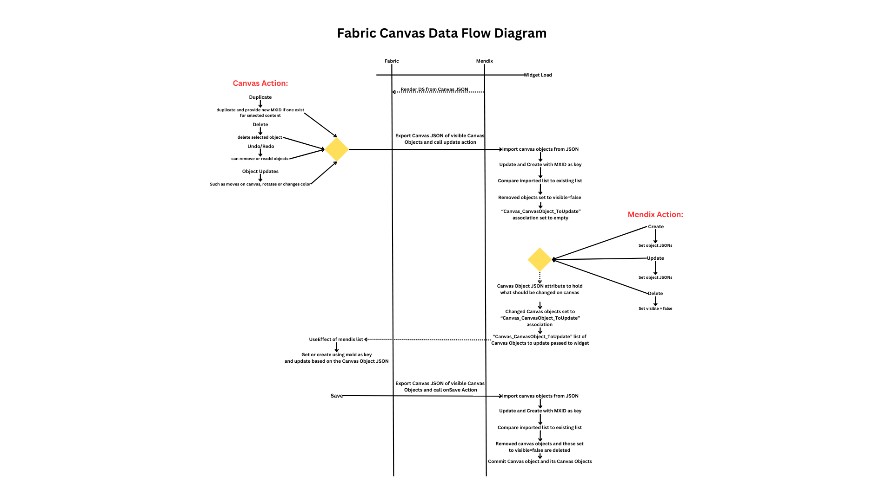

# **FabricCanvas**
The Fabric Canvas widget provides an interactive canvas to the Mendix UI while also allowing canvas data to be read and manipulated from an object oriented perspective within Mendix.

## <u>Typcial Usage Scenario</u>
The Fabric Canvas module and widget allows users the ability to create diagrams, drawings or layouts within the Mendix UI. A common use case for this module would be allowing a technician to add data points and mark ups to a blue print or floor plan.

## <u>Links</u>
* [<u>Demo</u>](https://fabriccanvas-sandbox.mxapps.io/)
* [<u>FabricJS</u>](http://fabricjs.com/docs/)
* [<u>FabricJS-React</u>](https://www.npmjs.com/package/fabricjs-react)

## <u>Features</u>
#### **<u>Nav Bar</u>**
* <u>Duplicate</u>: Clone selected canvas content
* <u>Delete</u>: Delete selected canvas content
* <u>Undo</u>: Undo the last change made on the canvas
* <u>Redo</u>: Redo the last change undone on the canvas
* <u>Group</u>: Group selected canvas content together
* <u>Ungroup</u>: Ungroup any selected canvas content
* <u>Move To Back</u>: Move any selected canvas content to the back of any other canvas content
* <u>Move To Front</u>: Move any selected canvas content to the front of any other canvas content
* <u>Lock</u>: Lock all canvas content currently on canvas
* <u>Toggle Drawing</u>: This allows for drawing on the canvas
* <u>Draw Size</u>: This changes the size of the drawing stencil
* <u>Add Text</u>: This allows for adding a textbox to the canvas
* <u>Add Shape</u>: This allows for adding shapes (Square, Circle, Triangle, Diamond, Left Arrow, Double Arrow, Line, Ellipse, Rectangle, Right Triangle, Arc) to the canvas.

#### **<u>Keyboard Shortcuts</u>**
* <u>Arrow keys</u>: Move selected objects around canvas
* <u>Delete/Backspace</u>: Delete selected objects
* <u>Ctrl+z</u>: Undo
* <u>Ctrl+y</u>: Redo

## <u>Configuration</u>
The Fabric Canvas widget has a **<u>Basic</u>** and **<u>Advanced</u>** configurations.

#### **<u>Basic</u>**
* <u>Data Sources:</u> 
  * <u>Canvas JSON</u>: Attribute to store the JSON of the canvas contents (no string limit)
  * <u>Selected Content JSON (Optional)</u>: Attribute to store the JSON of the selected canvas contents (no string limit)
  * <u>Image to Add (Optional)</u>: Association to system.image to allow for adding mendix images to canvas

* <u>Events</u>
  * <u>On Save (Optional)</u>: Action to be performed when Save Button is clicked
  * <u>On Selection (Optional)</u>: Action to be performed when canvas objects are selected
  * <u>On Add Image (Optional)</u>: Action to be performed when Add Image Button is clicked
  * <u>Click to Canvas</u>: When the Image to Add association is set, this will allow you to click on the canvas to add the image. When false, images will be positioned automatically when Image to Add association is set.
  * <u>Has Keyboard Controls</u>: Available Keyboard controls consist of:
    * <u>Arrow keys</u>: Move selected objects around canvas
    * <u>Delete/Backspace</u>: Delete selected objects
    * <u>Ctrl+z</u>: Undo
    * <u>Ctrl+y</u>: Redo

* <u>Appearance</u>
  * <u>Show Toolbar</u>: Setting this to false will hide the toolbar
  * <u>Show Add Image Btn</u>: Will perform On Add Image action
  * <u>Show Save Btn</u>: Will export the JSON of the current canvas to the Canvas JSON attribute and perform the On Save action
  * <u>Show Clear Canvas Btn</u>: Will clear all contents of the canvas
  * <u>Show Download Btn</u>: Will download canvas as a png
  * <u>Default Color</u>: Default CSS color for canvas, this includes shapes, text and drawing stencil

#### **<u>Advanced</u>**
Using the advanced configuration of the application allows for canvas objects to be mapped to mendix objects. See data flow diagram below for more in depth description.
  * <u>Canvas Object DS</u>: Canvas Objects list
  * <u>Canvas Object JSON</u>: JSON of canvas object
  * <u>On Canvas Change</u>: Action to be performed when a canvas actions occurs such as duplicate, delete, undo, redo, canvas object moves or changes color. Prior to this action being called, the canvas JSON will be exported to the 'Canvas JSON' attribute

### <u>Data Flow Diagram</U>

## <u>Limitations</u>
#### <u>Images</u>
When adding images, SVGs must have specified height and width, otherwise the SVG will use the entire screen as the parent container.
When images are added to the canvas they use the mendix file folder path. If the images are deleted form mendix then they will not be able to be referenced and shown on the canvas.

#### <u>Nav Bar</u>
Advanced has all of the basic nav bar abilities with the exception of group and ungroup

## <u>Development and Contribution</u>
1. Install NPM package dependencies by using: `npm install`. If you use NPM v7.x.x, which can be checked by executing `npm -v`, execute: `npm install --legacy-peer-deps`.
1. Run `npm start` to watch for code changes. On every change:
    - the widget will be bundled;
    - the bundle will be included in a `dist` folder in the root directory of the project;
    - the bundle will be included in the `deployment` and `widgets` folder of the Mendix test project.

## <u>Contributors</u>
Luke Karlovich, Sam Egan, Tom Slesinger, Kyle Ward, Brett Kolinek, Ashley Cheung and Conner Charlebois